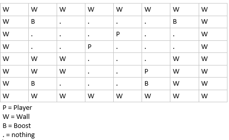
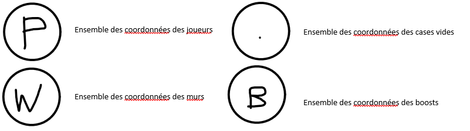
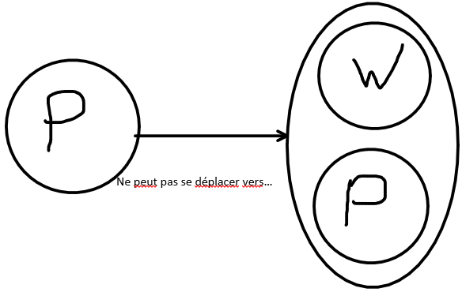
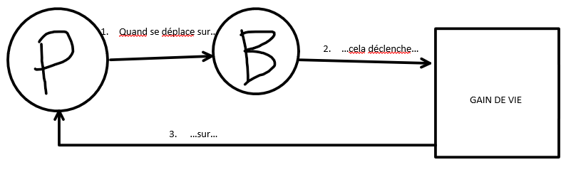

# Faire des algorithmes
Faire des algorithmes, c'est faire se succeder des manipulations de données, dans le but de sortir d'autres données particulières.


## Types de données primitifs

Passons les operations mathematiques habituelles et les détails techniques, en informatique il existe un nombre limité de structures et types de données.


D'après [wikipédia](https://en.wikipedia.org/wiki/Data_type), ces types sont:

- les **nombres entiers**
- les **booléens**
- les **caractères**
- les **nombres à virgule flottante**
- les **chaines alphanumériques**

Ces types représentent toutes les données de base que vous pourriez avoir à manipuler.

## Types de données spéciales

Le **pointeur** est considéré comme un type de donnée dérivé d'une donnée et est relativement unique en son genre.

Certains langages permettent aussi de considérer des **fonctions** comme un type, et donc de les manipuler dans des variables, python par exemple.


## Types de données composées


Une variable qui combine plusieurs données est appelé une variable de type composée:

- le **tableau** qui contient un nombre spécifique de données d'un type particulier par exemple
- les **tuples** qui contiennent typiquement une séquence de données de type arbitraire, pouvant être nommées
- les **unions** qui sont des tuples pouvant déterminer le type de données pouvant y être stockées
- les **ensembles** qui peuvent contenir certaines valeurs sans ordre particulier et sans répétition
- les **objets** qui sont comme des tuples, pouvant contenir des données de type arbitraire mais aussi des fonctions permettant d'y accèder ou de les modifier, appelées les méthodes

Et j'en passe.

## Types de données abstraits (ADT)

Ce qui nous intéresse vraiment ici sont les [types de données abstraits](https://en.wikipedia.org/wiki/Abstract_data_type#Examples_2)...

Ces types de données sont appelés abstraits car leur type ne spécifie aucune implementation particulière, autrement dit: Ils peuvent être implémentés de diverses façons.

Évidemment, savoir les implémenter est important mais pas nécessaire pour s'en servir, je vous recommande d'utiliser les implementations standard des langages que vous utilisez, qui sont déjà optimisés au maximum et prêts à l'emploi.

Ces types de données sont très importants à maîtriser:

- La **liste** (List) permet de créer des tableaux de taille inconnue, autrement dit des **vecteurs**
- Les **ensembles** (Set) permettent de créer **des ensembles de valeurs uniques**
- Les **sacs** (Multi-Set, Bag) permettent de créer des ensembles dans lesquels **les objets sont uniques, mais où deux objets équivalents sont tous deux stockés**
- Les **dictionnaires** (Map) permettent d'**associer une valeur clé à une valeur cible**
- Les **multi-dictionnaires** (Multi-Map) sont une généralisation des dictionnaires, permettant d'**associer un ensemble de valeurs cibles à une même clé**
- Les **graphes** (Graph) permettent de **représenter des relations entre des données**
- Les **arbres** (Tree) sont des graphes particuliers permettant de **représenter des dépendances**
- Les **piles** (Stack) permettent de **représenter des piles de données**
- Les **files** (Queue) permettent de **représenter diverses formes de files d'attente**
- Les **files de priorité** (Priority queue) permettent de **représenter des files d'attente où les éléments sont insérés et retirés selon leur priorité**
- Les **files à double-tête** (Double-ended Queue, Deque) permettent de **représenter des files d'attente pouvant être utilisées dans les deux sens**
- Les **files de priorité à double-tête** (Double-ended priority queue) permettent de **représenter des files d'attentes permettant la récupération efficace des éléments les moins et plus prioritaires**

## Comment bien choisir ses structures de données

Il peut être compliqué de bien voir comment résoudre un problème particulier, avec une telle quantité de structures différentes.

Je vous propose ici un petit algorithme de refléxion:

1. noter les données que nous avons à disposition en détail, et les schématiser.
2. se dire à voix haute comment vous raisonneriez si vous étiez à la place de la machine et l'écrire.
3. déterminer les données qui peuvent se déterminer à partir de logique et les mettre de coté.
4. déterminer les données qui symbolisent un manque d'interaction entre vos données et retirez les.
5. re-raisonnez à partir des informations restantes et écrivez en francais quelles données sont liées auxquelles et comment.

À ce niveau là vous devriez avoir quelques phrases qui résument les structures et données qu'elles sont censé contenir.

Exemple:
```python
# Problême: Nous avons une grille de 8x8 contenant des joueurs, des
# murs aléatoires, des cases de boost et autrement rien au sol
#
# Les joueurs peuvent se déplacer sur leurs cases adjacentes tant qu'ils
# ne rencontrent pas de joueurs ni de murs
#
# Si un joueur se déplace sur un boost, il regagne de la vie
```
```
# 1. noter les données que nous avons à disposition en détail, et les schématiser
```








```
# 2. se dire à voix haute comment vous raisonneriez si vous étiez à la place de la machine et l'écrire.
```
> - À chaque tour de jeu, je peux me déplacer si j'ai une case adjacente de libre.

```
# 3. déterminer les données qui peuvent se déterminer à partir de logique et les mettre de coté
```
> - D'après nos schémas, on peut déterminer si une case est non libre en vérifiant si elle contient un joueur ou un mur.
De même, on peut déterminer quand redonner de la vie si la case sur laquelle il se déplace contient un boost.

> - On garde donc les positions des joueurs, des boosts et des murs de coté pour le moment.

```
# 4. déterminer les données qui symbolisent un manque d'interaction entre vos données et retirez les.
```
> - D'après nos schémas, seules les cases vides n'ont aucun effet sur le jeu. On les retire donc de nos données.

```
# 5. re-raisonnez à partir des informations restantes et écrivez en francais quelles données sont liées auxquelles et comment
```
> - Le joueur peut bouger sur une case si celle ci n'appartient ni aux coordonnées d'un joueur ni d'un mur.

> - Si celle ci appartient aux coordonnées d'un boost, cela déclenche un regain de vie sur ce joueur.

Nous avons au final juste besoin de 3 **ensembles** de coordonnées, celles des joueurs, des murs et des boosts, rien de plus, rien de moins.

## Et si mon problème est très complexe?

Meme concept, découpez votre problème en plus petits bouts et vérifiez qui as besoin de quoi dans votre projet pour déterminer les données inutiles.

Une interface as t elle vraiment besoin d une liste de coordonnées si elle peut parcourir un ensemble?

Avez vous vraiment besoin de stocker les coordonnées d'un joueur en dehors du modèle?
Si oui, un dictionnaire serait il plus approprié qu'une liste?

Etc..

## J'ai envie d'aller plus loin!

Et bien il est temps de se plonger dans le monde merveilleux de l'optimisation de performances!

Il existe [bien d'autres variantes de chacune de ces structures](https://en.wikipedia.org/wiki/List_of_data_structures), et hybrider plusieurs structures de suite peut permettre de profiter des avantages des deux en évitant certains de leurs désavantages!

Certains types sont plus lents à parcourir (Listes) tandis que certains offrent un accès instantané à la présence d'une donnée (Ensemble), par conséquent enregistrer les entrées et sorties dans une liste à un ensemble permet par exemple de pouvoir chercher instantanément si un élément est présent ou pas dans cette liste!

Les combinaisons possibles sont aussi variées que spécifiques, le lien vers wikipédia ci dessus vous permettras de découvrir l'intégralité des structures existantes et documentées jusqu'ici!